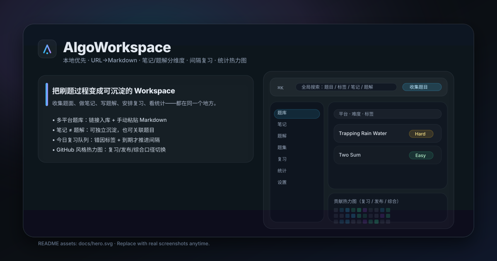
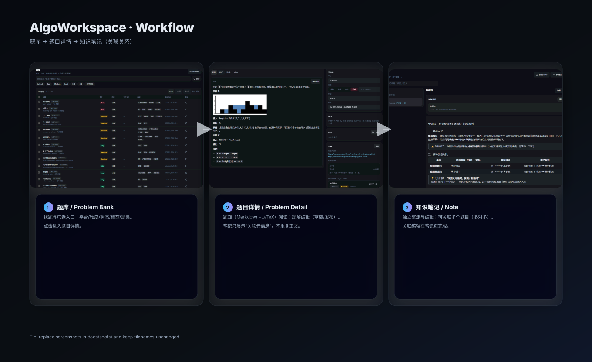
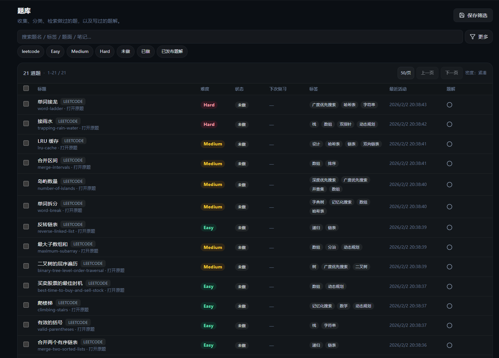
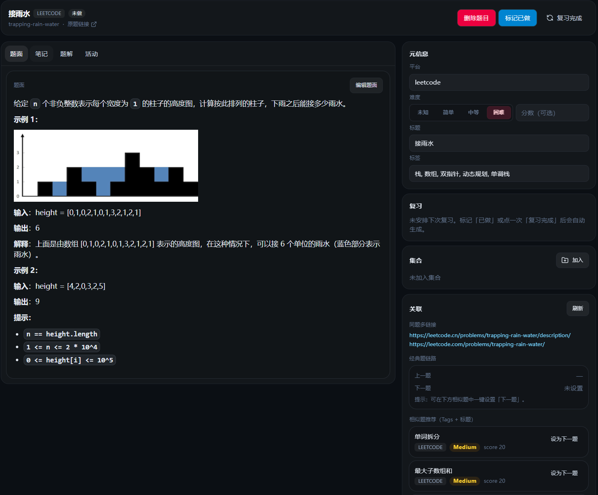
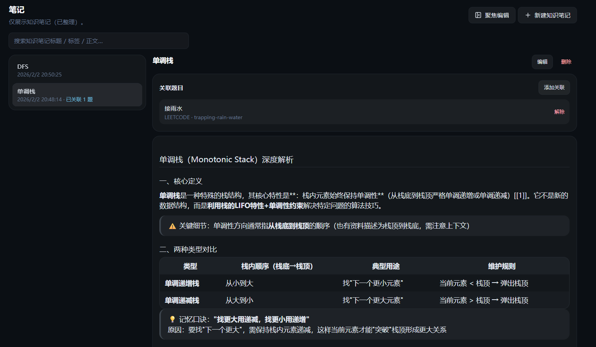

# AlgoWorkspace

本地优先的算法题 Workspace：收集题面（URL → Markdown）、笔记与题解沉淀、题集计划、间隔复习、统计热力图。单体应用，无需登录。

## Live Demo

体验链接（GitHub Pages）：https://CHZarles.github.io/AlgoProblem/



## Overview

AlgoWorkspace 是一个本地优先的刷题工作台：把「题面 / 笔记 / 题解 / 复习 / 统计」放进同一个 Workspace 里，强调高密度信息可读、全局可搜索、强反馈与可迁移的数据形态。

## Screenshots



- ① 题库：筛选/检索/标签与状态管理，进入题目详情页
- ② 题目详情：题面（Markdown + LaTeX）与题解编辑；仅展示“关联笔记”的元信息（不重复展示正文）
- ③ 知识笔记：独立沉淀与管理；可关联多个题目；关联编辑在笔记页完成

<details>
  <summary>查看原始截图（problem-bank / problem-detail / problem-note）</summary>
  <p>
    
  </p>
  <p>
    
  </p>
  <p>
    
  </p>
</details>

## 适用人群

- 在校算法竞赛 / 校招刷题
- 想把「题面 / 笔记 / 题解」分维度沉淀，并支持检索/筛选/统计的人

## Features

- **题库（Problem Bank）**
  - URL 收集 / 手动粘贴 Markdown 入库
  - 标签 / 状态 / 题集筛选 + 全局搜索
- **题目详情（Problem Detail）**
  - 题面：Markdown + LaTeX（KaTeX）渲染
  - 笔记：知识笔记为主，可关联多个题目（非 1:1）
  - 题解：多语言、草稿/发布、复杂度字段
- **题集（Plan / Collections）**
  - 题单目标、截止日期、进度条、拖拽排序、自动生成每日任务
- **复习系统（Spaced Repetition）**
  - 生成「今日复习队列」
  - 支持错因标签；未到期/当天重复打卡会忽略，避免误操作推远间隔
- **统计（Stats）**
  - GitHub 风格贡献热力图，口径可切换（综合 / 复习 / 发布）
- **Markdown 编辑体验**
  - Tab 缩进 / Shift+Tab 反缩进
  - Enter 自动续行：列表 / 任务清单（todo list）
  - GFM：任务清单、表格、删除线等（预览支持勾选任务）
- **题面图片缓存（按需）**
  - 渲染时将题面中的远程图片临时改写为本地代理地址（不修改入库 Markdown）
  - 首次打开自动下载并缓存到本地；后续直接读取缓存（离线可用）
- **主题**
  - 深色 / 浅色 / 秋天

## Ingest Rules

- **入库必须有 Markdown 题面**（支持 LaTeX）
- **LeetCode / AcWing 优先结构化抓取**
  - 目标：尽量贴近原题排版，降低数字/公式/样例被误改的概率
  - AcWing：可配置 Cookie 处理需要登录的题
- **其他链接**
  - 若已配置 LLM：优先用 LLM 抽取题面 Markdown（失败回退通用抓取）
- 也支持 **手动粘贴 Markdown** 直接入库

## Development

```bash
npm install
npm run dev
```

默认：

- Web：`http://localhost:5173`
- API：`http://localhost:8787`
- 数据库：`.data/algoworkspace.sqlite`

## Static Demo（GitHub Pages）

如果你希望在 GitHub 上展示一个「可点击的在线 Demo」，推荐使用本项目的 Demo 模式（无需后端）。

- Demo 模式：`VITE_DEMO=true`
- 数据存储：浏览器 `localStorage`（首次自动注入示例数据）
- 路由：Demo 下使用 Hash（避免 GitHub Pages 刷新 404）
- 说明：Demo 主要用于展示 UI/交互；抓取/LLM/SQLite 等能力需要本地后端

### 本地构建/预览 Demo

```bash
npm run build:demo
npm run preview:demo
```

### 部署到 GitHub Pages

1. 推送到 `main` 或 `master`
2. GitHub 仓库设置：`Settings → Pages → Build and deployment → Source: GitHub Actions`
3. 等待 workflow：`Deploy Demo to GitHub Pages` 完成发布

提示：如果组织策略禁用 Pages，该 workflow 也会失败，需要在仓库/组织侧开启 Pages。

## Production（本地可选）

```bash
npm run build
npm run start
```

## Desktop App（Electron / Windows）

本项目也提供 Electron 桌面版（内置后端与 SQLite），适合本地长期使用。

- 下载：GitHub Releases（安装包在 Release 附件中）
- 本地开发启动：`npm run electron:dev`
- 本地打包（Windows x64）：`npm run dist:win`

## Configuration（可选配置）

### LLM（可选）

设置页支持配置 `Base URL / Model / API Key`，用于从「非 LeetCode / AcWing 链接」抽取题面 Markdown。

说明：

- 后端按 OpenAI 风格的 `chat/completions` 调用（会尝试 `.../chat/completions` 与 `.../v1/chat/completions`）
- 示例 Base URL：
  - 智谱：`https://open.bigmodel.cn/api/paas/v4`
  - OpenAI：`https://api.openai.com/v1`

### AcWing Cookie（可选）

部分 AcWing 题目需要登录后才能抓取，设置页可填写 Cookie 用于抓取。

## Data & Backup

- 本项目为**单体本地 Workspace**：数据默认存储在 `.data/`（已在 `.gitignore` 排除）
- 图片缓存：与数据库同目录的 `assets/images/`（例如 `.data/assets/images/`）
- 备份建议：直接复制数据库所在目录（默认 `.data/`），可同时包含图片缓存
- Static Demo 的数据在浏览器侧（`localStorage`），可通过设置页导出/导入（JSON）

## Environment Variables（可选环境变量）

- `PORT`：API 端口（默认 `8787`）
- `DATABASE_PATH`：数据库路径（默认 `.data/algoworkspace.sqlite`）
- `CORS_ORIGIN`：开发时允许跨域的前端地址（默认 `http://localhost:5173`）

## Tech Stack

- Frontend：Vite + React + Tailwind + Radix UI
- Markdown：`react-markdown` + `remark-gfm` + `remark-math` + `rehype-katex` + `rehype-highlight`
- Backend：Express + SQLite（better-sqlite3）

## Notes（注意事项）

- 题面抓取涉及第三方站点内容，请自行遵守对应站点的条款与版权要求。

## License

当前仓库未包含 License 文件；如需开源发布，建议补充明确的 License（例如 MIT / Apache-2.0）。
