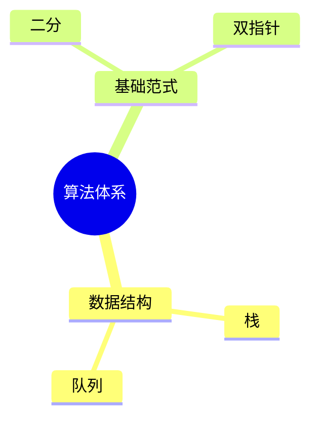

# Studio 内容编辑规范（Mindmap / Roadmap / Notes / Category）

这份文档约定了在 **Studio** 中编辑各类内容时的统一格式，目标是：

- **可读**：纯 Markdown 也能直接阅读
- **可维护**：diff 友好、结构稳定、可长期迭代
- **可关联**：通过 `id` / 链接把内容串起来（以后也方便做导入/索引）

> 建议：所有内容用 `.md` 维护；元信息用 YAML frontmatter；正文保持 Markdown 原生可读。

---

## 1. 通用约定（所有类型通用）

### 1.1 文件与编码

- 文件格式：`UTF-8`，扩展名统一为 `.md`
- 换行：`LF`

### 1.2 文件命名（推荐）

统一命名为：

```
{type}__{id}__{slug}.md
```

示例：

- `mindmap__mm_algo__algorithm-system.md`
- `roadmap__rm_2026_h1__algoworkspace-h1.md`
- `note__n_prefixsum__prefix-sum-template.md`
- `category__c_graph__graph.md`

命名原则：

- `type`：`mindmap | roadmap | note | category`
- `id`：稳定 ID（不要随意改），建议只用 `[a-z0-9_]+`
- `slug`：可读标题的简化版（可改，`id` 不变即可）

### 1.3 元信息（YAML frontmatter）

每个文件顶部放 YAML frontmatter（可选但强烈推荐）：

```md
---
type: note
id: n_prefixsum
title: 前缀和模板
tags:
  - template
  - array
updated_at: 2026-02-10
---
```

建议字段（按需取用）：

- `type`：文档类型（必填）
- `id`：稳定 ID（必填）
- `title`：标题（必填）
- `tags`：标签数组（可选）
- `status`：`draft | active | deprecated`（可选）
- `created_at` / `updated_at`：`YYYY-MM-DD`（可选）
- `related`：关联对象（可选，建议用数组）
  - `problem_ids`：关联题目 ID/slug
  - `note_ids` / `mindmap_ids` / `category_ids`

### 1.4 链接与关联（推荐）

- 关联优先用 **相对路径 Markdown 链接**：`[文本](./note__xxx.md)`
- 同时在 frontmatter 里放 `related.*` 作为“机器索引兜底”（可选）

---

## 2. Mindmap（思维导图）

Mindmap 的**源格式**推荐用“树状列表”（纯 Markdown 可读、易维护）。

### 2.1 源格式：树状列表（推荐）

规则：

- 节点用 `-` 列表
- 子节点缩进 **2 个空格**
- 同一层尽量保持语义一致（名词/动词统一）

模板：

```md
---
type: mindmap
id: mm_algo
title: 算法体系
tags:
  - map
  - algo
updated_at: 2026-02-10
---

- 算法
  - 数据结构
    - 栈 / 队列
    - 哈希表
    - 堆（优先队列）
  - 基础范式
    - 双指针
    - 二分
    - 贪心
    - 递归 / 分治
  - 图论
    - BFS / DFS
    - 最短路
    - 拓扑排序
  - 动态规划
    - 状态设计
    - 转移方程
    - 优化（滚动数组 / 单调队列）
```

### 2.2 节点内备注（可选）

如果需要给节点加一句说明，推荐用 `::`：

```md
- 二分 :: 写清楚单调性与边界
```

### 2.3 可视化（可选）

如果需要在 GitHub 上显示成图，可以额外维护一个 `mermaid` 块（可选）：

````md

````

注意：

- Mermaid 是“可视化辅助”，**树状列表才是源格式**（便于长期维护与 diff）。

---

## 3. Roadmap（路线图）

Roadmap 推荐用“里程碑 + 任务清单（checkbox）”。

### 3.1 基本结构（推荐）

模板：

```md
---
type: roadmap
id: rm_2026_h1
title: 2026 H1 Roadmap
status: active
owner: charles
updated_at: 2026-02-10
---

## Milestone: v0.2（导出/迁移完善）
- [ ] 导出 Markdown Bundle：支持图片与跨文档跳转
- [ ] 从 Bundle 导入（保留 id 关联）

## Milestone: v0.3（复习体验提升）
- [ ] 今日复习队列：按难度/错因权重排序
- [ ] 题目详情页：显示“下次复习时间”与间隔来源

## Milestone: v0.4（性能与稳定性）
- [ ] 题库按页加载 + 列表虚拟化
- [ ] 抓取失败原因拆分（403/Cookie/超时/解析为空）
```

### 3.2 任务行的元信息（可选）

为了可检索/可筛选，建议在任务行里加轻量标记：

```md
- [ ] [P0] 导出/导入一致性校验 @due(2026-03-31) #backup
```

约定（可选）：

- 优先级：`[P0] [P1] [P2]`
- 截止：`@due(YYYY-MM-DD)`
- 标签：`#backup #ux #perf`

---

## 4. Notes（笔记）

Notes 是最自由的一类，但建议固定“读者路径”，让笔记更像可复用的资产。

### 4.1 推荐结构（模板）

````md
---
type: note
id: n_prefixsum
title: 前缀和：一页模板
tags:
  - template
  - array
related:
  problem_ids:
    - leetcode:range-sum-query-immutable
updated_at: 2026-02-10
---

## TL;DR
- 前缀和把区间和查询变成 O(1)
- 注意下标偏移与边界

## 模板
```cpp
// pre[i] 表示前 i 个元素之和（1-based）
// sum(l,r) = pre[r] - pre[l-1]
```

## 常见坑
- 空数组/单元素
- 下标越界（l=0 时）
````

### 4.2 图片（可选）

如果你在编辑器里直接粘贴图片，Markdown 会插入类似：

```md

```

这类图片会被缓存到本地，导出 Markdown Bundle 时也会被带上（便于做成“可迁移的知识库”）。

---

## 5. Category（分类页 / 索引页）

Category 的定位是“目录/索引”，把同一主题的 mindmap / notes / roadmap 串起来。

### 5.1 推荐结构（模板）

```md
---
type: category
id: c_graph
title: Graph（图论）
tags:
  - graph
updated_at: 2026-02-10
---

## Mindmaps
- [算法体系（图论部分）](../mindmaps/mindmap__mm_algo__algorithm-system.md)

## Notes
- [BFS：层序/最短路/连通块](../notes/note__n_graph_bfs__bfs.md)
- [最短路：Dijkstra / 0-1 BFS](../notes/note__n_shortest_path__shortest-path.md)

## Roadmaps
- [v0.3：复习体验提升](../roadmaps/roadmap__rm_2026_h1__algoworkspace-h1.md#milestone-v03复习体验提升)
```

建议：

- Category 内链接尽量稳定（相对路径 + 锚点）
- 只做“入口与导航”，不要把正文重复贴一遍
